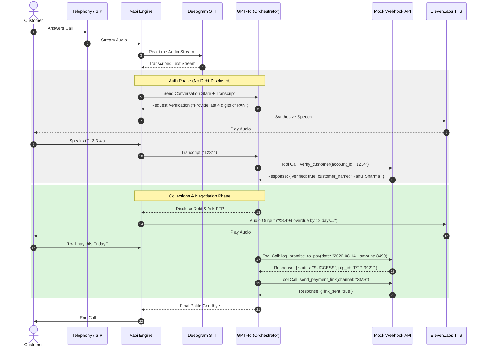

# High-Level Design Document
## Outbound Voice AI Collections Agent — "Maya" (Kapture Finance)

**Version:** 1.0
**Owner:** Voice AI Engineering
**Scope:** Automated outbound collections call, identity-gated debt disclosure, PTP negotiation, disposition logging.

---

## 1. Pipeline & Latency Budget

### 1.1 Architecture Flow

```
Telephony (SIP/PSTN)
      │
      ▼
Deepgram Nova-2 (STT)
      │
      ▼
Orchestrator / GPT-4o (LLM, temp 0.1)
      │
      ├──► Mock Webhook API (tool calls)
      │
      ▼
ElevenLabs / Cartesia (TTS)
      │
      ▼
Telephony Output
```

### 1.2 Latency Budget per Hop

| Hop | Component | Target Latency | Notes |
|---|---|---|---|
| 1 | Network ingress (SIP → Vapi) | ~50 ms | Carrier/PSTN dependent |
| 2 | STT (Deepgram Nova-2) | ~200 ms | Streaming, partial transcripts used for barge-in |
| 3 | LLM first byte (GPT-4o) | ~400 ms | Low temp (0.1) reduces retries/re-generation |
| 4 | Tool call round-trip (webhook) | ~150–300 ms | Only on turns that trigger a function call |
| 5 | TTS synthesis first audio chunk | ~300 ms | Streamed, not waiting for full sentence |
| 6 | Network egress (Vapi → Telephony) | ~150 ms | |
| **Total (no tool call)** | | **< 1.2 s** | End-to-end target |
| **Total (with tool call)** | | **< 1.5 s** | Acceptable bump on verification/PTP turns |

### 1.3 Mitigations for Latency Overruns
- Stream TTS audio as soon as the first sentence is generated rather than waiting for the full LLM response.
- Keep the mock/production webhook synchronous and sub-300ms — no blocking I/O, no cold starts (keep server warm).
- Use `gpt-4o-mini` if `gpt-4o` first-byte latency exceeds budget under load.

---

## 2. State Machine

### 2.1 States

| State | Description |
|---|---|
| `INIT` | Call connects, greeting delivered |
| `AUTH_PENDING` | Awaiting identity verification input |
| `AUTHENTICATED` | `verify_customer` returned `verified: true` |
| `NEGOTIATION` | Debt disclosed, intent being determined (PTP / hardship / dispute / already paid) |
| `PTP_COLLECTED` | Promise-to-Pay captured and logged |
| `ESCALATED` | Routed to human agent (hardship or dispute) |
| `CALL_ENDED` | Disposition logged, call terminated |

### 2.2 Transition Table

| From | Event | To | Guard |
|---|---|---|---|
| `INIT` | Customer confirms identity ("yes, this is Rahul") | `AUTH_PENDING` | — |
| `INIT` | Customer denies / unavailable | `CALL_ENDED` | `mark_disposition(WRONG_PERSON)` fires first |
| `AUTH_PENDING` | `verify_customer` → `verified: true` | `AUTHENTICATED` | **Hard lock** — no debt term may be spoken before this transition |
| `AUTH_PENDING` | `verify_customer` → `verified: false` | `AUTH_PENDING` (retry, max 2) then `CALL_ENDED` | After 2 failures, disposition `NO_RESPONSE`/escalation |
| `AUTHENTICATED` | Debt disclosed | `NEGOTIATION` | — |
| `NEGOTIATION` | Customer agrees to pay | `PTP_COLLECTED` | `log_promise_to_pay` + `send_payment_link` fire |
| `NEGOTIATION` | Customer claims already paid | `CALL_ENDED` | `mark_disposition(ALREADY_PAID)` |
| `NEGOTIATION` | Hardship claim | `ESCALATED` | `escalate_to_agent(HARDSHIP_REQUEST)` |
| `NEGOTIATION` | Dispute | `ESCALATED` | `escalate_to_agent(DISPUTE)` |
| `NEGOTIATION` / any | DNC request | `CALL_ENDED` | `mark_disposition(DO_NOT_CALL)` — immediate, no further negotiation |
| `PTP_COLLECTED` / `ESCALATED` | Wrap-up complete | `CALL_ENDED` | `mark_disposition` fires with final status |

### 2.3 Explicit Compliance Rule

> Transitions out of `AUTH_PENDING` into `AUTHENTICATED` are strictly locked behind a successful `verify_customer(status: success)` tool response. The LLM must not use the words "overdue," "loan," "EMI," "amount," or "Kapture Finance debt" in any state prior to `AUTHENTICATED`.

---

## 3. Intents & Entities Table

### 3.1 Intents

| Intent | Triggers From State | Resulting Action |
|---|---|---|
| `Confirm_Identity` | `INIT` | → `AUTH_PENDING` |
| `Provide_Verification` | `AUTH_PENDING` | Calls `verify_customer` |
| `Promise_To_Pay` | `NEGOTIATION` | Calls `log_promise_to_pay`, `send_payment_link` |
| `Already_Paid` | `NEGOTIATION` | Calls `mark_disposition(ALREADY_PAID)` |
| `Hardship_Claim` | `NEGOTIATION` | Calls `escalate_to_agent(HARDSHIP_REQUEST)` |
| `Dispute_Debt` | `NEGOTIATION` | Calls `escalate_to_agent(DISPUTE)` |
| `Request_DNC` | Any | Calls `mark_disposition(DO_NOT_CALL)`, ends call |
| `Wrong_Person` | `INIT` | Calls `mark_disposition(WRONG_PERSON)`, ends call |

### 3.2 Entities

| Entity | Type | Format | Example |
|---|---|---|---|
| `PTP_Date` | Date | ISO-8601 | `2026-08-14` |
| `PTP_Amount` | Number | Decimal, INR | `8499` |
| `Hardship_Reason` | String | Free text | `"job loss"` |
| `Verification_Code` | String | 4 digits or birth year | `"1234"` / `"1995"` |

---

## 4. Tool / API Specifications

All tools return JSON matching Vapi's expected `{ results: [{ toolCallId, result }] }` shape (see `mock-server/server.js`). Full JSON Schemas are in `vapi/tool_definitions.json`.

| Tool | Purpose | Key Inputs | Key Outputs |
|---|---|---|---|
| `verify_customer` | Authenticate caller before any disclosure | `account_id`, `verification_code` | `verified` (bool), `message` |
| `log_promise_to_pay` | Record PTP commitment | `account_id`, `ptp_date`, `amount` | `success`, `ptp_id` |
| `send_payment_link` | Dispatch payment link | `account_id`, `channel` (SMS/WhatsApp/BOTH) | `success`, `message` |
| `escalate_to_agent` | Route hardship/dispute to human | `account_id`, `reason` | `success`, `queued` |
| `mark_disposition` | Log final call outcome | `account_id`, `status` (enum), `notes` | `success`, `disposition_logged`, `timestamp` |

---

## 5. Auth & Data Safety Protocols

- **PII masking in logs:** Customer names are masked in server logs and analytics exports, e.g. `Rahul S****`. Full PAN/DOB values are never logged — only a boolean match result.
- **Zero-disclosure-before-auth:** The terms "Overdue," "Loan," "EMI," and "Kapture Finance debt" are blocked from the LLM's output vocabulary until `verify_customer` returns `verified: true`. This is enforced via the system prompt today; production should add a code-level output filter as a second layer of defense.
- **Verification code storage:** `verification_code` values are never persisted — they exist only in-memory for the duration of the tool call.
- **Transport security:** All webhook traffic runs over HTTPS (via ngrok in dev, a proper TLS cert in production).
- **Least privilege:** The mock server only exposes the 5 tool endpoints — no general data access.

---

## 6. Compliance & Guardrails

- **RBI Fair Practices Code adherence:**
  - Calling window restricted to **08:00–19:00 local time** — enforced at the dialer/campaign-scheduling layer, not just the prompt.
  - No third-party debt disclosure — enforced by the `AUTH_PENDING` state lock.
  - Instant opt-out — any DNC/"stop calling" utterance is handled immediately, in any state, ahead of the normal negotiation flow.
- **Hallucination prevention:**
  - Temperature fixed at `0.1`.
  - The agent is explicitly instructed it **cannot offer unauthorized waivers greater than 10%** of the outstanding amount.
  - The agent cannot invent new dates, amounts, or account details — it only reflects values from `CUSTOMER & ACCOUNT CONTEXT` in the system prompt or from tool responses.
- **Tone constraint:** Calm, firm, supportive, respectful — no threats, no raised urgency language, no harassment patterns (aligns with fair collections norms).
- **Abusive-user handling:** One clear verbal warning, then a soft, polite hangup (see Edge Case Matrix below).

---

## 7. Edge Cases Matrix

| Edge Case | Detection | Handling |
|---|---|---|
| Abusive/hostile user | Profanity or threats detected in transcript | 1 calm warning ("I understand this is frustrating, but I'll need to end the call if this continues") → soft hangup, `mark_disposition(status="NO_RESPONSE", notes="Abusive - terminated")` |
| Silent user / voicemail | No speech detected for N seconds | 2 re-prompts ("Hello, are you still there?") → hangup with `mark_disposition(status="NO_RESPONSE")` |
| Mid-call language switch (English ↔ Hindi) | STT language confidence shift / code-switch detected | Prompt instructs agent to mirror the customer's language (Hindi/Hinglish) without losing state or previously captured entities |
| Wrong number | Customer confirms they are not Rahul Sharma and Rahul is unavailable | `mark_disposition(status="WRONG_PERSON")`, polite close, no debt terms ever used |
| Repeated failed verification | 2 consecutive `verify_customer` failures | Do not disclose debt; offer to call back when the account holder is available; `mark_disposition(status="NO_RESPONSE", notes="Verification failed x2")` |
| Customer requests DNC mid-negotiation | "Stop calling me" / "put me on do not call" | Immediate `mark_disposition(status="DO_NOT_CALL")`, skip remaining negotiation, end call |
| Partial/garbled transcript | Low STT confidence score | Agent asks for a repeat rather than guessing entity values (especially `PTP_Amount`/`PTP_Date`) |

---

## 8. Observability Metrics

| Metric | Definition | Why It Matters |
|---|---|---|
| **Containment Rate** | % of calls resolved without human escalation | Measures automation efficiency; low rate signals prompt gaps or frequent hardship/dispute volume |
| **PTP Rate** | % of calls ending in a valid, logged Promise-to-Pay | Primary business outcome metric for collections effectiveness |
| **First Call Resolution (FCR)** | % of calls ending with a valid, non-ambiguous disposition logged | Tracks whether the agent reliably reaches a clean end-state rather than dropping/erroring out |
| **Auth Success Rate** | % of `verify_customer` calls returning `verified: true` on first attempt | Signals whether verification UX (prompt wording) is clear |
| **Average Handle Time (AHT)** | Mean call duration from `INIT` to `CALL_ENDED` | Efficiency and customer-experience proxy |
| **Compliance Violation Count** | Instances where debt terms were used before `AUTHENTICATED` | Should be zero; tracked via automated transcript scanning (see `tests/test_cases.json` TC-001) |

---

## Appendix: Sequence Diagram (Mermaid.js)



> Render this diagram to `System_Architecture.png` using the [Mermaid Live Editor](https://mermaid.live) (paste the code above, export as PNG) and drop the exported image into `docs/System_Architecture.png`.